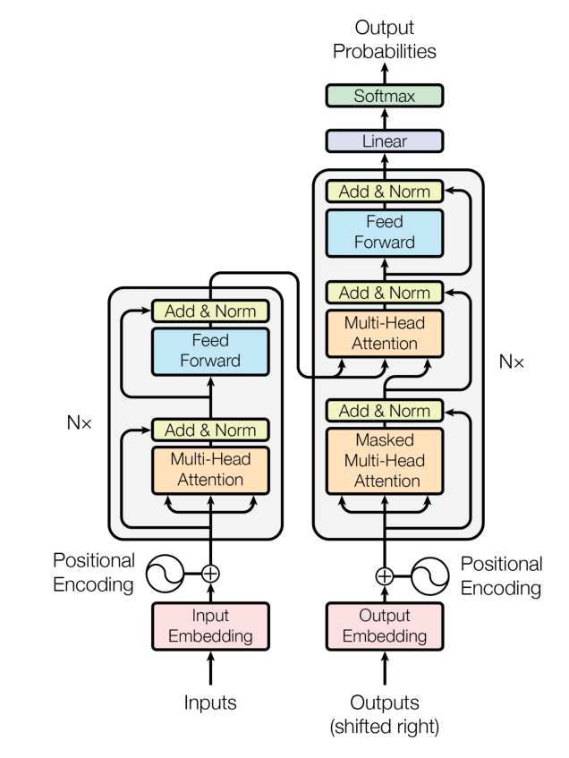
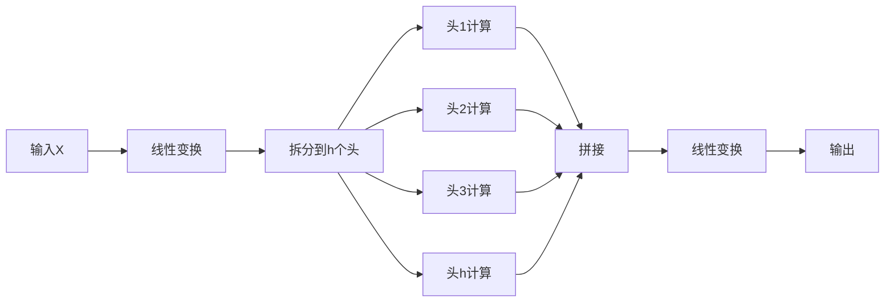

# 任务3 第二章 Transformer

[[_TOC_]]

本章目标：理解如何建立transformer




- Embedding
- Positional Encoding
- Encoder
  - 多头注意力层
  - 层归一化（Layer Normalization）和残差连接
  - 前馈神经网络
- Decoder

## 2.1.1 注意力机制之前的三种神经网络
- 前馈神经网络 Feedforward Neural Network FNN - 每层神经元都和上下两层的**每一个**神经元进行连接.
- 卷积神经网络 Convolutional Neural Network，CNN - 即先用全部特征的部分来训练的卷积层来进行特征提取，再用这些提取的特征来训练的全连接层来进行分类。
- 自回归神经网络 Recurrent Neural Network RNN - 能够使用历史信息作为输入、包含环和自重复的网络.

其中RNN是处理NLP任务的首选，但也有缺陷：
- 1. 序列依序计算的模式限制了计算机并行计算的能力
- 2. RNN难以捕捉长序列的相关关系

## 2.1.2 注意力机制
注意力机制最先源于计算机视觉领域，其核心思想为当我们关注一张图片，我们往往无需看清楚全部内容而仅将注意力集中在重点部分即可。而在自然语言处理领域，我们往往也可以通过将重点注意力集中在一个或几个 token，从而取得更高效高质的计算效果。

**注意力机制的本质**是对两段序列的元素依次进行相似度计算，寻找出一个序列的每个元素对另一个序列的每个元素的相关度，然后基于相关度进行加权，即分配注意力。

注意力机制有三个核心变量：Query（查询值）、Key（键值）和 Value（真值）。

### 用点积来计算词向量的相似度

$$
v \cdot w = \sum_{i} v_i w_i
$$

**公式解析**：
- **符号说明**：
  - `v` 和 `w`：两个相同维度的向量（如词向量）
  - `i`：向量的维度索引（词向量通常有数百维）
  - `v_i` 和 `w_i`：向量在第 `i` 维的分量值
- **计算过程**：
  1. 将两个向量**对应维度的值相乘**
  2. 对所有维度的乘积结果**求和**
- **几何意义**：  
  点积结果反映向量的方向相似性：  
  ✅ 正值 → 方向相近（相似度高）  
  ❌ 负值 → 方向相反（相似度低）  
  ⚠️ 零值 → 正交（无相关性）

---

🔍 计算示例（二维简化模型）
假设两个词向量：
- **"快乐"** 向量：`v = [2, 3]`
- **"喜悦"** 向量：`w = [1, 4]`

**点积计算步骤**：
| 维度 | v_i | w_i | v_i × w_i |
|------|-----|-----|-----------|
| 1    | 2   | 1   | 2×1 = **2** |
| 2    | 3   | 4   | 3×4 = **12** |
| **求和** | | | `2 + 12 = 14` |

**结果分析**：
- 点积值 **14** → 表示两词有较高相似性（都含积极语义）

---

⚖️ 对比案例：反义词计算
假设 **"悲伤"** 向量：`u = [-1, -2]`
- **"快乐" vs "悲伤"** 点积：  
  `(2×-1) + (3×-2) = -2 + (-6) = **-8**`  
  → 负值表明语义相反

---

💡 词向量应用要点
| 度量方式 | 公式 | 特点 | 推荐场景 |
|----------|------|------|----------|
| **原始点积** | `v·w` | 计算快，但受向量长度影响 | 快速初步筛选 |
| **余弦相似度** | `\frac{v·w}{\|v\| \|w\|}` | 归一化到 [-1,1]，消除长度影响 | 精准相似性判断 |

**实际应用**：
```python
# Python计算示例 (NumPy)
import numpy as np

v = np.array([2, 3])   # "快乐"向量
w = np.array([1, 4])   # "喜悦"向量
u = np.array([-1, -2]) # "悲伤"向量

dot_vw = np.dot(v, w)  # 输出: 14
dot_vu = np.dot(v, u)  # 输出: -8

# 余弦相似度计算
cos_sim = dot_vw / (np.linalg.norm(v) * np.linalg.norm(w))  # ≈ 0.94
```

> **关键结论**：点积是词向量相似性的基础度量，但实际应用中常结合归一化处理（如余弦相似度）以提升准确性。


---

### 词向量之间的相似度
- **`q`**：**查询向量（Query）**，表示当前关注的位置（例如序列中的某个词）。
- **`K`**：**键矩阵（Key）**，包含序列中所有位置的键向量（用于被查询）。
- **`x = qK^T`**：  
  计算 **`q`** 与 **`K`** 中所有键向量的点积（相似度得分）。结果 `x` 是一个向量，表示当前查询 `q` 与序列中每个位置的相似程度。


`x = qK^T` 的结果会进一步处理：
1. **缩放（Scale）**：`x / sqrt(d_k)`（`d_k` 是向量维度，避免点积过大导致梯度不稳定）。
2. **Softmax 归一化**：将 `x` 转换为概率分布（和为 1），得到注意力权重。
3. **加权求和**：用权重对 **值向量（Value）** 加权，生成最终注意力输出：  
   `Output = Softmax(x) · V`


#### **物理意义**
- **`qK^T`** 本质是计算 **序列中所有位置对当前查询的贡献权重**。
- 这是 Transformer 能捕捉长距离依赖的核心：无论词间距多远，直接计算相似度。


图示说明
```plaintext
         Key Matrix (K)
        +----+----+----+
        | k1 | k2 | ... | kn |   (每列是一个键向量)
        +----+----+----+
             |
             | 点积运算 (qK^T)
             ↓
Query (q) → [x1, x2, ..., xn]   (相似度得分向量)
```

为何重要？
- **并行计算**：所有位置的 `qK^T` 可同时计算（高效）。
- **动态权重**：根据输入动态分配注意力（优于 RNN/CNN 的固定模式）。
- **核心创新**：使 Transformer 在 NLP 任务中取得突破性性能。

如需深入，可参考文档中的 **Scaled Dot-Product Attention** 部分（通常含完整公式和代码实现）。


## 2.1.3 注意力机制的实现和计算函数的解释

让我们详细解释这行关键代码的作用，这是Transformer注意力机制的核心计算：

```python
scores = torch.matmul(query, key.transpose(-2, -1)) / math.sqrt(d_k)
```

### 1. **整体目标**
计算查询向量(query)和键向量(key)之间的**相似度分数**，这个分数决定了在生成输出时，模型应该"关注"输入序列中的哪些部分。

### 2. **张量形状说明**
假设：
- `query` 形状: `(batch_size, seq_len_q, d_k)`
- `key` 形状: `(batch_size, seq_len_k, d_k)`

其中：
- `batch_size`: 批处理大小（同时处理的样本数）
- `seq_len_q`: 查询序列长度
- `seq_len_k`: 键序列长度（通常与值序列长度相同）
- `d_k`: 特征维度（如512）

### 3. **分步解析**

#### (1) `key.transpose(-2, -1)`
- **作用**: 转置键矩阵的最后两个维度
- **原始形状**: `(batch_size, seq_len_k, d_k)`
- **转置后形状**: `(batch_size, d_k, seq_len_k)`
- **物理意义**: 准备矩阵乘法所需的维度对齐

#### (2) `torch.matmul(query, key.transpose(-2, -1))`
- **矩阵乘法**:
  - `query`: `(batch_size, seq_len_q, d_k)`
  - `key转置`: `(batch_size, d_k, seq_len_k)`
- **结果形状**: `(batch_size, seq_len_q, seq_len_k)`
- **计算内容**:
  ```python
  scores[i, j, k] = sum_{n=0}^{d_k-1} (query[i, j, n] * key[i, n, k])
  ```
  这实际上是**批量点积计算**：
  - 对于批次中的每个样本
  - 对于查询序列中的每个位置j
  - 计算该位置查询向量与键序列中所有位置k的键向量的点积

#### (3) `/ math.sqrt(d_k)`
- **作用**: 缩放点积结果
- **原因**:
  1. 当特征维度`d_k`较大时，点积结果会非常大
  2. 过大的值会使softmax进入饱和区（梯度接近0）
  3. 缩放后保持方差稳定（数学证明：Var(q·k) = d_k）
- **缩放因子**: √d_k（如d_k=512时，除以22.6）

### 4. **物理意义**
结果张量`scores`的每个元素表示：
- 对于批次中的每个样本
- 查询序列位置j与键序列位置k之间的相似度
- 值越大表示相关性越强

例如在机器翻译中：
- 当生成英文单词"bank"时
- 与输入法文序列中"banque"（银行）的点积分数会很高
- 与"rivière"（河流）的点积分数会较低

### 5. **可视化示例
假设：
- batch_size = 1
- seq_len_q = 2（两个查询词）
- seq_len_k = 3（三个键词）
- d_k = 4

```
查询矩阵 (query)       键矩阵转置 (key^T)
[ q11 q12 q13 q14 ]    [ k11 k21 k31 ]
[ q21 q22 q23 q24 ]    [ k12 k22 k32 ]
                       [ k13 k23 k33 ]
                       [ k14 k24 k34 ]

结果分数矩阵 (scores)
[ q1•k1  q1•k2  q1•k3 ]
[ q2•k1  q2•k2  q2•k3 ]

其中 q1•k1 = q11*k11 + q12*k12 + q13*k13 + q14*k14
```

### 6. **后续处理**
这个分数矩阵会继续用于：
```python
p_attn = scores.softmax(dim=-1)  # 转换为概率分布
output = torch.matmul(p_attn, value)  # 加权求和
```

### 为什么这样设计？
1. **高效计算**：一次矩阵乘法完成所有位置对的相似度计算
2. **内容感知**：动态生成注意力权重（不同于RNN/CNN的固定模式）
3. **可并行化**：充分利用GPU并行计算能力
4. **理论保障**：缩放操作确保梯度稳定（原始Transformer论文的核心创新点之一）

这个计算是Transformer能够同时处理长距离依赖和保持训练稳定性的关键，也是它优于传统RNN/LSTM架构的重要原因。


## 2.1.4 自注意力
实际应用中，只需要计算 Query 和 Key 之间的注意力结果，很少存在额外的真值 Value。也就是说，只需要拟合两个文本序列。
在 Transformer 的 Encoder 结构中，使用的是 注意力机制的变种 —— 自注意力（self-attention，自注意力）机制。所谓自注意力，即是计算本身序列中每个元素对其他元素的注意力分布，即在计算过程中，Q、K、V 都由同一个输入通过不同的参数矩阵计算得到。

在 Encoder 中，Q、K、V 分别是输入对参数矩阵 $W_q、W_k、W_v$ 做积得到，从而拟合输入语句中每一个 token 对其他所有 token 的关系。

通过自注意力机制，我们可以找到一段文本中每一个 token 与其他所有 token 的相关关系大小，从而建模文本之间的依赖关系。​在代码中的实现，self-attention 机制其实是通过给 Q、K、V 的输入传入同一个参数实现的：

```python
# attention 为上文定义的注意力计算函数
attention(x, x, x)
```

## 2.1.5 掩码自注意力
```python
# 创建一个上三角矩阵，用于遮蔽未来信息。
# 先通过 full 函数创建一个 1 * seq_len * seq_len 的矩阵
mask = torch.full((1, args.max_seq_len, args.max_seq_len), float("-inf"))
# triu 函数的功能是创建一个上三角矩阵
mask = torch.triu(mask, diagonal=1)
```

## 2.1.6 多头注意力机制（Multi-Head Attention）

Transformer中的"头"（Head）是一个核心概念，它指的是**多个独立的注意力计算单元**，每个单元专注于学习输入的不同方面的特征表示。以下是详细解释：

### 1. "头"的本质含义
- **多个独立的注意力机制**：每个"头"都是一套完整的注意力计算单元
- **并行处理**：所有头同时计算，互不干扰
- **特征多样性**：每个头学习输入的不同特征或关系

### 2. 为什么需要多个"头"？
| 单头注意力                 | 多头注意力                  |
|---------------------------|----------------------------|
| 只能学习一种注意力模式     | 可以学习多种注意力模式      |
| 表达能力有限               | 表达能力更强                |
| 可能遗漏重要信息           | 捕获更丰富的特征            |
| 类比：单角度观察           | 类比：多角度观察            |

### 3. 多头注意力的计算过程


#### 具体步骤：
1. **线性投影**：将输入拆分为h组查询(Q)、键(K)、值(V)
   ```python
   Q = linear_q(X).view(batch, seq, h, d_k)  # h个头，每个头维度d_k
   K = linear_k(X).view(batch, seq, h, d_k)
   V = linear_v(X).view(batch, seq, h, d_v)
   ```

2. **并行计算**：每个头独立计算注意力
   ```python
   # 第i个头的计算
   attn_i = softmax(Q_i @ K_i.T / sqrt(d_k)) @ V_i
   ```

3. **结果拼接**：合并所有头的输出
   ```python
   output = torch.cat([attn_1, attn_2, ..., attn_h], dim=-1)
   ```

4. **最终投影**：线性变换得到输出
   ```python
   final_output = linear_o(output)
   ```

### 4. "头"的物理意义 - 实际案例
在语言处理中，不同头可能关注：
1. **语法头**：关注词性关系（名词-动词）
   ```
   输入："The cat [chases] the mouse"
   关注：chases → cat, chases → mouse
   ```

2. **语义头**：关注同义/反义关系
   ```
   输入："big" and "large" are similar
   关注：big → large
   ```

3. **指代头**：关注代词指代
   ```
   输入："John saw Mary. [He] waved."
   关注：He → John
   ```

4. **长距离依赖头**：关注远距离关系
   ```
   输入："The cat [that] I saw yesterday was black"
   关注：that → cat
   ```

### 5. 技术优势
1. **增强表示能力**：每个头d_k维，总维度h×d_k ≈ 原始维度
   - 原始维度d_model = 512
   - 头数h=8 → 每个头d_k=64
   - 总维度：8×64=512（保持相同计算量）

2. **并行加速**：GPU可同时计算所有头

3. **正则化效果**：防止过拟合（类似集成学习）

4. **可解释性**：可视化不同头的关注模式

### 6. 在Transformer中的应用
- **原始论文设置**：
  - 基础模型：h=8头
  - 大型模型：h=16头
- **位置**：
  - 编码器：自注意力多头
  - 解码器：自注意力多头 + 编码器-解码器多头

### 7. 代码实现示例
```python
class MultiHeadAttention(nn.Module):
    def __init__(self, d_model, h):
        super().__init__()
        self.d_k = d_model // h  # 每个头的维度
        self.h = h               # 头数
        
        # 线性投影层
        self.W_q = nn.Linear(d_model, d_model)
        self.W_k = nn.Linear(d_model, d_model)
        self.W_v = nn.Linear(d_model, d_model)
        self.W_o = nn.Linear(d_model, d_model)
        
    def forward(self, Q, K, V):
        batch_size = Q.size(0)
        
        # 投影并分头 [batch, seq, d_model] -> [batch, seq, h, d_k]
        Q = self.W_q(Q).view(batch_size, -1, self.h, self.d_k).transpose(1, 2)
        K = self.W_k(K).view(batch_size, -1, self.h, self.d_k).transpose(1, 2)
        V = self.W_v(V).view(batch_size, -1, self.h, self.d_k).transpose(1, 2)
        
        # 每个头独立计算注意力
        scores = torch.matmul(Q, K.transpose(-2, -1)) / math.sqrt(self.d_k)
        attn = scores.softmax(dim=-1)
        context = torch.matmul(attn, V)  # [batch, h, seq, d_k]
        
        # 拼接所有头
        context = context.transpose(1, 2).contiguous().view(
            batch_size, -1, self.h * self.d_k)  # [batch, seq, d_model]
        
        return self.W_o(context)
```

### 8. 为什么比单头更有效？
1. **子空间学习**：每个头在不同子空间学习特征
2. **注意力专业化**：不同头关注不同类型的关系
3. **模型容错**：即使某个头学习失败，其他头可补偿
4. **信息冗余**：重要特征被多个头捕获，增强鲁棒性

### 总结
多头注意力中的"头"：
1. **本质**：独立的注意力计算单元
2. **目的**：让模型从不同角度/子空间学习特征
3. **优势**：增强表达能力、提升性能、改善可解释性
4. **实现**：通过线性投影分割输入，并行计算后拼接
5. **效果**：使Transformer能同时捕获语法、语义、指代等多种语言关系

这种设计是Transformer在各种任务中表现出色的关键原因之一，它模仿了人类多角度理解信息的认知方式。

## 2.1.6 多头注意力机制（Multi-Head Attention）中的"头"（Head）

"头"是一个核心概念，它指的是**多个独立的注意力计算单元**，每个单元专注于学习输入的不同方面的特征表示。以下是详细解释：

### 1. "头"的本质含义
- **多个独立的注意力机制**：每个"头"都是一套完整的注意力计算单元
- **并行处理**：所有头同时计算，互不干扰
- **特征多样性**：每个头学习输入的不同特征或关系

### 2. 为什么需要多个"头"？
| 单头注意力                 | 多头注意力                  |
|---------------------------|----------------------------|
| 只能学习一种注意力模式     | 可以学习多种注意力模式      |
| 表达能力有限               | 表达能力更强                |
| 可能遗漏重要信息           | 捕获更丰富的特征            |
| 类比：单角度观察           | 类比：多角度观察            |

### 3. 多头注意力的计算过程


#### 具体步骤：
1. **线性投影**：将输入拆分为h组查询(Q)、键(K)、值(V)
   ```python
   Q = linear_q(X).view(batch, seq, h, d_k)  # h个头，每个头维度d_k
   K = linear_k(X).view(batch, seq, h, d_k)
   V = linear_v(X).view(batch, seq, h, d_v)
   ```

2. **并行计算**：每个头独立计算注意力
   ```python
   # 第i个头的计算
   attn_i = softmax(Q_i @ K_i.T / sqrt(d_k)) @ V_i
   ```

3. **结果拼接**：合并所有头的输出
   ```python
   output = torch.cat([attn_1, attn_2, ..., attn_h], dim=-1)
   ```

4. **最终投影**：线性变换得到输出
   ```python
   final_output = linear_o(output)
   ```

### 4. "头"的物理意义 - 实际案例
在语言处理中，不同头可能关注：
1. **语法头**：关注词性关系（名词-动词）
   ```
   输入："The cat [chases] the mouse"
   关注：chases → cat, chases → mouse
   ```

2. **语义头**：关注同义/反义关系
   ```
   输入："big" and "large" are similar
   关注：big → large
   ```

3. **指代头**：关注代词指代
   ```
   输入："John saw Mary. [He] waved."
   关注：He → John
   ```

4. **长距离依赖头**：关注远距离关系
   ```
   输入："The cat [that] I saw yesterday was black"
   关注：that → cat
   ```

### 5. 技术优势
1. **增强表示能力**：每个头d_k维，总维度h×d_k ≈ 原始维度
   - 原始维度d_model = 512
   - 头数h=8 → 每个头d_k=64
   - 总维度：8×64=512（保持相同计算量）

2. **并行加速**：GPU可同时计算所有头

3. **正则化效果**：防止过拟合（类似集成学习）

4. **可解释性**：可视化不同头的关注模式

### 6. 在Transformer中的应用
- **原始论文设置**：
  - 基础模型：h=8头
  - 大型模型：h=16头
- **位置**：
  - 编码器：自注意力多头
  - 解码器：自注意力多头 + 编码器-解码器多头

### 7. 代码实现示例
```python
class MultiHeadAttention(nn.Module):
    def __init__(self, d_model, h):
        super().__init__()
        self.d_k = d_model // h  # 每个头的维度
        self.h = h               # 头数
        
        # 线性投影层
        self.W_q = nn.Linear(d_model, d_model)
        self.W_k = nn.Linear(d_model, d_model)
        self.W_v = nn.Linear(d_model, d_model)
        self.W_o = nn.Linear(d_model, d_model)
        
    def forward(self, Q, K, V):
        batch_size = Q.size(0)
        
        # 投影并分头 [batch, seq, d_model] -> [batch, seq, h, d_k]
        Q = self.W_q(Q).view(batch_size, -1, self.h, self.d_k).transpose(1, 2)
        K = self.W_k(K).view(batch_size, -1, self.h, self.d_k).transpose(1, 2)
        V = self.W_v(V).view(batch_size, -1, self.h, self.d_k).transpose(1, 2)
        
        # 每个头独立计算注意力
        scores = torch.matmul(Q, K.transpose(-2, -1)) / math.sqrt(self.d_k)
        attn = scores.softmax(dim=-1)
        context = torch.matmul(attn, V)  # [batch, h, seq, d_k]
        
        # 拼接所有头
        context = context.transpose(1, 2).contiguous().view(
            batch_size, -1, self.h * self.d_k)  # [batch, seq, d_model]
        
        return self.W_o(context)
```

### 8. 为什么比单头更有效？
1. **子空间学习**：每个头在不同子空间学习特征
2. **注意力专业化**：不同头关注不同类型的关系
3. **模型容错**：即使某个头学习失败，其他头可补偿
4. **信息冗余**：重要特征被多个头捕获，增强鲁棒性

### 总结
多头注意力中的"头"：
1. **本质**：独立的注意力计算单元
2. **目的**：让模型从不同角度/子空间学习特征
3. **优势**：增强表达能力、提升性能、改善可解释性
4. **实现**：通过线性投影分割输入，并行计算后拼接
5. **效果**：使Transformer能同时捕获语法、语义、指代等多种语言关系

这种设计是Transformer在各种任务中表现出色的关键原因之一，它模仿了人类多角度理解信息的认知方式。

# 2.2 Encoder-Decoder
在Transformer中，使用注意力机制的是其两个核心组件——Encoder（编码器）和 Decoder（解码器）。

## 2.2.1 Seq2Seq模型
Seq2Seq(序列到序列)，是经典NLP任务，指模型输入的是一个自然语言序列 $input = (x_1, x_2, x_3...x_n)$，输出的是一个可能不等长的自然语言序列 $output = (y_1, y_2, y_3...y_m)$。
对于 Seq2Seq 任务，一般的思路是对自然语言序列进行编码再解码。

编码，就是将输入的自然语言序列通过隐藏层编码成能够表征语义的向量（或矩阵），可以简单理解为更复杂的词向量表示。
解码，就是对输入的自然语言序列编码得到的向量或矩阵通过隐藏层输出，再解码成对应的自然语言目标序列。通过编码再解码，就可以实现 Seq2Seq 任务。

## 2.2.2 前馈神经网络
前馈神经网络（Feed Forward Neural Network，FFN），每一层的神经元都和上下两层的每一个神经元完全连接的网络结构。每一个 Encoder Layer 都包含一个上文讲的注意力机制和一个前馈神经网络。
Transformer 的前馈神经网络是由两个线性层中间加一个 RELU 激活函数组成的，以及前馈神经网络还加入了一个 Dropout 层来防止过拟合。

实现了一个简单的**前馈神经网络**（Feed-Forward Network）

### 1. 类结构和初始化

```python
class MLP(nn.Module):
    def __init__(self, dim: int, hidden_dim: int, dropout: float):
        super().__init__()
        self.w1 = nn.Linear(dim, hidden_dim, bias=False)
        self.w2 = nn.Linear(hidden_dim, dim, bias=False)
        self.dropout = nn.Dropout(dropout)
```

**参数解释：**
- `dim`：输入/输出维度（通常与Transformer的隐藏层大小相同）
- `hidden_dim`：中间隐藏层维度（通常比`dim`大，例如在原始Transformer中是4倍）
- `dropout`：Dropout比例（防止过拟合）

**层说明：**
1. `w1`：第一层线性变换（`dim → hidden_dim`）
2. `w2`：第二层线性变换（`hidden_dim → dim`）
3. `dropout`：Dropout层（在输出前应用）

**特点：**
- 无偏置项（`bias=False`），这是某些Transformer实现的常见做法
- 保持输入输出维度相同（残差连接的基础）

### 2. 前向传播

```python
def forward(self, x):
    return self.dropout(self.w2(F.relu(self.w1(x))))
```

**计算流程：**


**详细步骤：**

1. **第一层变换**：
   ```python
   h = self.w1(x)  # 形状不变: (batch, seq_len, dim) → (batch, seq_len, hidden_dim)
   ```
   - 将输入投影到更高维空间（通常hidden_dim=4×dim）
   - 增加模型容量，学习更复杂的特征

2. **非线性激活**：
   ```python
   h_activated = F.relu(h)
   ```
   - 使用ReLU激活函数：`max(0, x)`
   - 引入非线性，使网络能学习复杂模式
   - 相比sigmoid/tanh更高效（计算简单，缓解梯度消失）

3. **第二层变换**：
   ```python
   output = self.w2(h_activated)  # 形状: (batch, seq_len, hidden_dim) → (batch, seq_len, dim)
   ```
   - 投影回原始维度
   - 保持输入输出形状一致（为残差连接准备）

4. **Dropout正则化**：
   ```python
   output = self.dropout(output)
   ```
   - 训练时随机置零部分神经元（比例由`dropout`参数控制）
   - 防止过拟合，增强模型泛化能力
   - 推理时自动关闭

### 3. 在Transformer中的位置和作用

**典型Transformer层结构：**
```
输入 → 多头注意力 → Add & Norm → MLP → Add & Norm → 输出
```

**MLP的作用：**
1. **特征增强**：在注意力机制后进一步处理特征
2. **非线性转换**：引入额外的非线性能力（注意力主要是线性变换）
3. **维度扩展/压缩**：通过hidden_dim增加模型容量
4. **位置独立处理**：对序列中每个位置独立操作

### 4. 设计特点分析

1. **瓶颈结构**：
   - `dim → 4×dim → dim` 的形状变化
   - 先扩展后压缩，增加中间表示能力
   - 类似自动编码器的思想

2. **无偏置设计**：
   - `bias=False` 减少参数数量
   - 在某些实现中能提高训练稳定性
   - 但原始Transformer论文是包含偏置的

3. **激活函数选择**：
   - 使用ReLU而非更复杂的激活函数
   - 计算高效，适合大规模模型
   - 现代变体可能使用GELU/SiLU等

4. **无归一化层**：
   - 注意：LayerNorm在MLP外部（在Transformer层中）
   - 这种设计使MLP保持简洁

### 5. 数学表示

前向传播可表示为：
```
FFN(x) = Dropout(W₂ · ReLU(W₁ · x))
```
其中：
- `W₁ ∈ ℝ^{dim×hidden_dim}`
- `W₂ ∈ ℝ^{hidden_dim×dim}`

### 6. 与原始Transformer的对比

**原始Transformer的FFN：**
```python
FFN(x) = max(0, xW₁ + b₁)W₂ + b₂
```

**本实现的差异：**
1. 移除了偏置项（`b₁`, `b₂`）
2. 将max(0,x)替换为F.relu（功能相同）
3. 增加了Dropout层（原始论文在残差连接后应用Dropout）

### 7. 实际数据流示例

假设：
- `dim = 512`
- `hidden_dim = 2048`
- 输入形状：`(batch=32, seq_len=64, dim=512)`

```python
# 前向传播过程
h1 = self.w1(x)      # (32, 64, 512) → (32, 64, 2048)
h_act = F.relu(h1)   # (32, 64, 2048) [应用ReLU]
h2 = self.w2(h_act)  # (32, 64, 2048) → (32, 64, 512)
output = self.dropout(h2)  # (32, 64, 512) [部分元素置零]
```

### 8. 为什么需要MLP？

1. **补充注意力机制**：
   - 注意力擅长捕捉位置间关系
   - MLP擅长处理位置内特征

2. **增强模型容量**：
   - 通过hidden_dim增加参数数量
   - 使网络能学习更复杂的函数

3. **提供非线性**：
   - 纯注意力层是线性变换的堆叠
   - ReLU引入关键的非线性能力

4. **位置独立处理**：
   - 对每个token单独处理
   - 与注意力的全局交互形成互补

这个MLP模块虽然结构简单，但它是Transformer能够学习复杂模式的关键组件之一，为模型提供了必要的非线性变换能力和特征增强功能。


## 2.2.3 层归一化

神经网络主流的归一化一般有两种
- 批归一化 **Batch Normalization (BN)**  
  *对神经网络每批输入进行归一化，加速训练*  
  `torch.nn.BatchNorm1d/2d/3d` in PyTorch

- 层归一化 **Layer Normalization (LN)**  
  *对单个样本所有特征进行归一化（Transformer 常用）*  
  `torch.nn.LayerNorm`

- 区别
  Batch Norm 在每一层统计所有样本的均值和方差，Layer Norm 在每个样本上计算其所有层的均值和方差，从而使每个样本的分布达到稳定。Layer Norm 的归一化方式其实和 Batch Norm 是完全一样的，只是统计统计量的维度不同。层归一化是在 Transformer 中最常用的归一化方式。

## 2.2.4 残差连接
残差连接，即下一层的输入不仅是上一层的输出，还包括上一层的输入。残差连接允许最底层信息直接传到最高层，让高层专注于残差的学习。
$$
x = x + MultiHeadSelfAttention(LayerNorm(x))
$$

$$
output = x + FNN(LayerNorm(x))
$$

## 2.2.5 Encoder
- 搭建一个Encoder，由 N 个 Encoder Layer 组成，在最后会加入一个 Layer Norm 实现规范化。
- Encoder Layer 包括一个注意力层和一个前馈神经网络。
  
## 2.2.6 Decoder
- 搭建 Decoder, 由 N 个 Decoder Layer 组装为 Decoder。
- 和 Encoder 不同的是，Decoder 由两个注意力层和一个前馈神经网络组成。第一个注意力层是一个掩码自注意力层，即使用 Mask 的注意力计算，保证每一个 token 只能使用该 token 之前的注意力分数；第二个注意力层是一个多头注意力层，该层将使用第一个注意力层的输出作为 query，使用 Encoder 的输出作为 key 和 value，来计算注意力分数。最后，再经过前馈神经网络.

# 2.3 Transformer
基于Encoder、Decoder组件，搭建起一个完整的 Transformer 模型。

## 2.3.1 Embedding层
NLP任务中,Embedding层将**自然语言的输入**转化为机器可以处理的**向量**。Embedding 层其实是一个存储固定大小的词典的嵌入向量查找表。在输入神经网络之前，我们往往会先让自然语言输入通过分词器 tokenizer，分词器的作用是把自然语言输入切分成 token 并转化成一个固定的 index。

torch 中的 Embedding 层：
```python
self.tok_embeddings = nn.Embedding(args.vocab_size, args.dim)
```

## 2.3.2 Positional Encoding 位置编码
为使用序列顺序信息，保留序列中的相对位置信息，Transformer 采用了位置编码机制，即根据序列中 token 的相对位置对其进行编码，再将位置编码加入词向量编码中。位置编码的方式有很多，Transformer 使用了正余弦函数来进行位置编码（绝对位置编码Sinusoidal）。

## 2.3.3 Transformer
图解transformer，经过 tokenizer 映射后的输出先经过 Embedding 层和 Positional Embedding 层编码，然后进入上一节讲过的 N 个 Encoder 和 N 个 Decoder（在 Transformer 原模型中，N 取为6），最后经过一个线性层和一个 Softmax 层就得到了最终输出, 基于之前所实现过的组件，我们实现完整的 Transformer 模型.


## 补充：编码器（Encoder）和解码器（Decoder）的区别
Transformer 模型中的编码器（Encoder）和解码器（Decoder）是两个关键组件，它们在结构和功能上有着显著区别。以下是两者的详细对比分析：

---

### 1. **核心功能区别**
| **组件** | **主要功能** | **类比** |
|----------|--------------|----------|
| **编码器** | 将输入序列转换为富含语义的上下文表示 | 像"理解者"：阅读并理解源语言句子 |
| **解码器** | 基于编码器的表示逐步生成目标序列 | 像"表达者"：根据理解生成目标语言句子 |

---

### 2. **结构组成对比**
#### 编码器层（Encoder Layer）：


#### 解码器层（Decoder Layer）：


**关键差异：**
1. 解码器多一个注意力层（编码器-解码器注意力）
2. 解码器使用掩码自注意力

---

### 3. **注意力机制差异**
| **注意力类型** | **位置** | **作用** | **可访问信息** |
|----------------|----------|----------|----------------|
| **自注意力** | 编码器 | 理解输入序列内部关系 | 整个输入序列 |
| **掩码自注意力** | 解码器第一层 | 防止看到未来信息 | 仅当前及之前位置 |
| **交叉注意力** | 解码器第二层 | 融合编码器信息 | 整个编码器输出 |

---

### 4. **工作流程对比**
#### 编码器工作：
1. 接收输入序列（如英文句子）
2. 通过多层编码提取抽象特征
3. 输出上下文表示（一组向量）

#### 解码器工作：
1. 接收起始token（如`<sos>`）
2. 逐步生成：
   - 使用掩码自注意力处理已生成序列
   - 通过交叉注意力获取编码器信息
   - 预测下一个token
3. 重复直到生成结束token（如`<eos>`）

```plaintext
示例（机器翻译）：
编码器输入: "I love you"
解码器生成: 
  步骤1: 输入"<sos>" → 输出"我"
  步骤2: 输入"<sos>我" → 输出"爱"
  步骤3: 输入"<sos>我爱" → 输出"你"
  步骤4: 输入"<sos>我爱你" → 输出"<eos>"
```

---

### 5. **训练与推理差异**
| **阶段** | **编码器** | **解码器** |
|----------|------------|------------|
| **训练** | 一次处理完整输入 | 使用"教师强制"（接收完整目标序列） |
| **推理** | 一次处理完整输入 | 自回归生成（逐个token生成） |

**教师强制（Teacher Forcing）**：
```python
# 训练时解码器输入
decoder_input = "<sos> 我 爱 你"  # 完整目标序列（去掉最后一个token）
target_output = "我 爱 你 <eos>"   # 完整目标序列（去掉第一个token）
```

---

### 6. **技术实现差异**
#### 掩码机制：
```python
# 解码器掩码（防止看到未来）
mask = torch.triu(torch.ones(seq_len, seq_len), diagonal=1)
```

#### 编码器-解码器注意力：
```python
# 在解码器中
cross_attn = MultiHeadAttention(
    query=decoder_output,  # 来自解码器
    key=encoder_output,    # 来自编码器
    value=encoder_output   # 来自编码器
)
```

---

### 7. **位置数量差异**
| 模型 | 编码器层数 | 解码器层数 | 论文 |
|------|------------|------------|------|
| 原始Transformer | 6 | 6 | Attention is All You Need |
| BERT | 12-24 | 0 | BERT论文 |
| GPT-3 | 0 | 96 | GPT-3论文 |

---

### 8. **典型应用场景**
| **架构** | **组成** | **应用场景** | **代表模型** |
|----------|----------|--------------|--------------|
| 编码器-解码器 | Enc+Dec | 机器翻译、摘要生成 | Transformer, T5 |
| 仅编码器 | Enc | 文本分类、命名实体识别 | BERT, RoBERTa |
| 仅解码器 | Dec | 文本生成、对话系统 | GPT系列, LLaMA |

---

### 9. **信息流可视化**
```
编码器:
输入序列 → [自注意力] → [特征融合] → 上下文向量

解码器:
已生成序列 → [掩码自注意力] → 
          ↘
编码器输出 → [交叉注意力] → 
          ↗
         → [预测下一个token]
```

---

### 10. **为什么需要分离设计？**
1. **信息隔离**：
   - 编码器专注理解源信息
   - 解码器专注生成目标信息

2. **计算优化**：
   - 编码器一次计算整个输入
   - 解码器逐步生成输出

3. **功能专业化**：
   - 编码器：特征提取器
   - 解码器：条件生成器

---

### 总结：核心区别
| **特性** | **编码器** | **解码器** |
|----------|------------|------------|
| **主要作用** | 理解输入 | 生成输出 |
| **注意力类型** | 自注意力 | 掩码自注意力 + 交叉注意力 |
| **信息访问** | 完整输入 | 仅历史输出 + 编码器信息 |
| **训练方式** | 并行处理 | 教师强制 |
| **推理方式** | 单次计算 | 自回归生成 |
| **典型输出** | 上下文向量 | 目标序列 |

这种分离设计使Transformer能同时处理理解（编码器）和生成（解码器）两种本质上不同的认知任务，成为序列到序列学习的强大架构。理解它们的区别是掌握Transformer工作原理的关键。