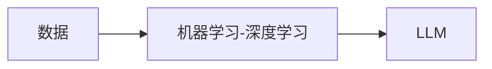

# 内容介绍和前言

绝大多数参与现代生活的人都会和LLM建立起一定的关系，但一般都是作为Chat应用的最终用户。即使我这样的IT从业人员，要从破碎的AI知识体系中建立起LLM的系统化知识也并不容易。这个项目吸引让人的地方在，并非只是单纯的介绍LLM本身和与之相关的产品特性，而是从神经网络开始，介绍LLM发展的土壤和过程，并且提供大量实践的机会，无论是对于实际开发，还是面试，都是非常有价值的。

个人觉得，本项目最重要的作用，把IT领域里，从数据开始到最新的LLM知识梳理的非常清楚。

## 关于学习内容和任务目标
   - 深入理解 Transformer 架构和注意力机制
   - 掌握 预训练语言模型的基本原理
   - 了解 现有大模型的基本结构
   - 动手实现 一个完整的 LLaMA2 模型
   - 掌握训练 从预训练到微调的全流程
   - 实战应用 RAG、Agent 等前沿技术

其实从第一个目标开始，就需要一定的知识储备，后期都是实战的部分，不清楚学习曲线是否会非常陡峭，但内容非常有吸引力。

## 对于datawhale的想法
用空没空都会去kaggle看看，学习的道路上最好的是，有教程可以看，有人可以问。非常感谢datawhale前人种树后人也参与一起种树的社区建设，无论是对我们的下一代在校学生，还是从业者，或者处于转型期的社会劳动力，都是一个温暖的鼓励，有时候也代表了一种新的希望，学习的路上有你(们)真好。 

   

<button onclick="window.location.href=""> 开机！</button>
