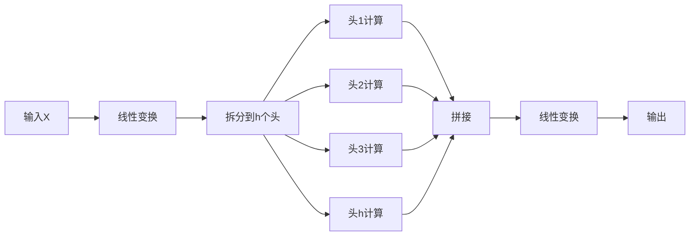

# 任务3 第二章 注意力机制

## 2.1.1 注意力机制之前的三种神经网络
- 前馈神经网络 Feedforward Neural Network FNN - 每层神经元都和上下两层的**每一个**神经元进行连接.
- 卷积神经网络 Convolutional Neural Network，CNN - 即先用全部特征的部分来训练的卷积层来进行特征提取，再用这些提取的特征来训练的全连接层来进行分类。
- 自回归神经网络 Recurrent Neural Network RNN - 能够使用历史信息作为输入、包含环和自重复的网络.

其中RNN是处理NLP任务的首选，但也有缺陷：
- 1. 序列依序计算的模式限制了计算机并行计算的能力
- 2. RNN难以捕捉长序列的相关关系

## 2.1.2 注意力机制
注意力机制最先源于计算机视觉领域，其核心思想为当我们关注一张图片，我们往往无需看清楚全部内容而仅将注意力集中在重点部分即可。而在自然语言处理领域，我们往往也可以通过将重点注意力集中在一个或几个 token，从而取得更高效高质的计算效果。

**注意力机制的本质**是对两段序列的元素依次进行相似度计算，寻找出一个序列的每个元素对另一个序列的每个元素的相关度，然后基于相关度进行加权，即分配注意力。

注意力机制有三个核心变量：Query（查询值）、Key（键值）和 Value（真值）。

### 用点积来计算词向量的相似度

$$
v \cdot w = \sum_{i} v_i w_i
$$

**公式解析**：
- **符号说明**：
  - `v` 和 `w`：两个相同维度的向量（如词向量）
  - `i`：向量的维度索引（词向量通常有数百维）
  - `v_i` 和 `w_i`：向量在第 `i` 维的分量值
- **计算过程**：
  1. 将两个向量**对应维度的值相乘**
  2. 对所有维度的乘积结果**求和**
- **几何意义**：  
  点积结果反映向量的方向相似性：  
  ✅ 正值 → 方向相近（相似度高）  
  ❌ 负值 → 方向相反（相似度低）  
  ⚠️ 零值 → 正交（无相关性）

---

🔍 计算示例（二维简化模型）
假设两个词向量：
- **"快乐"** 向量：`v = [2, 3]`
- **"喜悦"** 向量：`w = [1, 4]`

**点积计算步骤**：
| 维度 | v_i | w_i | v_i × w_i |
|------|-----|-----|-----------|
| 1    | 2   | 1   | 2×1 = **2** |
| 2    | 3   | 4   | 3×4 = **12** |
| **求和** | | | `2 + 12 = 14` |

**结果分析**：
- 点积值 **14** → 表示两词有较高相似性（都含积极语义）

---

⚖️ 对比案例：反义词计算
假设 **"悲伤"** 向量：`u = [-1, -2]`
- **"快乐" vs "悲伤"** 点积：  
  `(2×-1) + (3×-2) = -2 + (-6) = **-8**`  
  → 负值表明语义相反

---

💡 词向量应用要点
| 度量方式 | 公式 | 特点 | 推荐场景 |
|----------|------|------|----------|
| **原始点积** | `v·w` | 计算快，但受向量长度影响 | 快速初步筛选 |
| **余弦相似度** | `\frac{v·w}{\|v\| \|w\|}` | 归一化到 [-1,1]，消除长度影响 | 精准相似性判断 |

**实际应用**：
```python
# Python计算示例 (NumPy)
import numpy as np

v = np.array([2, 3])   # "快乐"向量
w = np.array([1, 4])   # "喜悦"向量
u = np.array([-1, -2]) # "悲伤"向量

dot_vw = np.dot(v, w)  # 输出: 14
dot_vu = np.dot(v, u)  # 输出: -8

# 余弦相似度计算
cos_sim = dot_vw / (np.linalg.norm(v) * np.linalg.norm(w))  # ≈ 0.94
```

> **关键结论**：点积是词向量相似性的基础度量，但实际应用中常结合归一化处理（如余弦相似度）以提升准确性。


---

### 词向量之间的相似度
- **`q`**：**查询向量（Query）**，表示当前关注的位置（例如序列中的某个词）。
- **`K`**：**键矩阵（Key）**，包含序列中所有位置的键向量（用于被查询）。
- **`x = qK^T`**：  
  计算 **`q`** 与 **`K`** 中所有键向量的点积（相似度得分）。结果 `x` 是一个向量，表示当前查询 `q` 与序列中每个位置的相似程度。


`x = qK^T` 的结果会进一步处理：
1. **缩放（Scale）**：`x / sqrt(d_k)`（`d_k` 是向量维度，避免点积过大导致梯度不稳定）。
2. **Softmax 归一化**：将 `x` 转换为概率分布（和为 1），得到注意力权重。
3. **加权求和**：用权重对 **值向量（Value）** 加权，生成最终注意力输出：  
   `Output = Softmax(x) · V`


#### **物理意义**
- **`qK^T`** 本质是计算 **序列中所有位置对当前查询的贡献权重**。
- 这是 Transformer 能捕捉长距离依赖的核心：无论词间距多远，直接计算相似度。


图示说明
```plaintext
         Key Matrix (K)
        +----+----+----+
        | k1 | k2 | ... | kn |   (每列是一个键向量)
        +----+----+----+
             |
             | 点积运算 (qK^T)
             ↓
Query (q) → [x1, x2, ..., xn]   (相似度得分向量)
```

为何重要？
- **并行计算**：所有位置的 `qK^T` 可同时计算（高效）。
- **动态权重**：根据输入动态分配注意力（优于 RNN/CNN 的固定模式）。
- **核心创新**：使 Transformer 在 NLP 任务中取得突破性性能。

如需深入，可参考文档中的 **Scaled Dot-Product Attention** 部分（通常含完整公式和代码实现）。


## 2.1.3 注意力机制的实现和计算函数的解释

让我们详细解释这行关键代码的作用，这是Transformer注意力机制的核心计算：

```python
scores = torch.matmul(query, key.transpose(-2, -1)) / math.sqrt(d_k)
```

### 1. **整体目标**
计算查询向量(query)和键向量(key)之间的**相似度分数**，这个分数决定了在生成输出时，模型应该"关注"输入序列中的哪些部分。

### 2. **张量形状说明**
假设：
- `query` 形状: `(batch_size, seq_len_q, d_k)`
- `key` 形状: `(batch_size, seq_len_k, d_k)`

其中：
- `batch_size`: 批处理大小（同时处理的样本数）
- `seq_len_q`: 查询序列长度
- `seq_len_k`: 键序列长度（通常与值序列长度相同）
- `d_k`: 特征维度（如512）

### 3. **分步解析**

#### (1) `key.transpose(-2, -1)`
- **作用**: 转置键矩阵的最后两个维度
- **原始形状**: `(batch_size, seq_len_k, d_k)`
- **转置后形状**: `(batch_size, d_k, seq_len_k)`
- **物理意义**: 准备矩阵乘法所需的维度对齐

#### (2) `torch.matmul(query, key.transpose(-2, -1))`
- **矩阵乘法**:
  - `query`: `(batch_size, seq_len_q, d_k)`
  - `key转置`: `(batch_size, d_k, seq_len_k)`
- **结果形状**: `(batch_size, seq_len_q, seq_len_k)`
- **计算内容**:
  ```python
  scores[i, j, k] = sum_{n=0}^{d_k-1} (query[i, j, n] * key[i, n, k])
  ```
  这实际上是**批量点积计算**：
  - 对于批次中的每个样本
  - 对于查询序列中的每个位置j
  - 计算该位置查询向量与键序列中所有位置k的键向量的点积

#### (3) `/ math.sqrt(d_k)`
- **作用**: 缩放点积结果
- **原因**:
  1. 当特征维度`d_k`较大时，点积结果会非常大
  2. 过大的值会使softmax进入饱和区（梯度接近0）
  3. 缩放后保持方差稳定（数学证明：Var(q·k) = d_k）
- **缩放因子**: √d_k（如d_k=512时，除以22.6）

### 4. **物理意义**
结果张量`scores`的每个元素表示：
- 对于批次中的每个样本
- 查询序列位置j与键序列位置k之间的相似度
- 值越大表示相关性越强

例如在机器翻译中：
- 当生成英文单词"bank"时
- 与输入法文序列中"banque"（银行）的点积分数会很高
- 与"rivière"（河流）的点积分数会较低

### 5. **可视化示例
假设：
- batch_size = 1
- seq_len_q = 2（两个查询词）
- seq_len_k = 3（三个键词）
- d_k = 4

```
查询矩阵 (query)       键矩阵转置 (key^T)
[ q11 q12 q13 q14 ]    [ k11 k21 k31 ]
[ q21 q22 q23 q24 ]    [ k12 k22 k32 ]
                       [ k13 k23 k33 ]
                       [ k14 k24 k34 ]

结果分数矩阵 (scores)
[ q1•k1  q1•k2  q1•k3 ]
[ q2•k1  q2•k2  q2•k3 ]

其中 q1•k1 = q11*k11 + q12*k12 + q13*k13 + q14*k14
```

### 6. **后续处理**
这个分数矩阵会继续用于：
```python
p_attn = scores.softmax(dim=-1)  # 转换为概率分布
output = torch.matmul(p_attn, value)  # 加权求和
```

### 为什么这样设计？
1. **高效计算**：一次矩阵乘法完成所有位置对的相似度计算
2. **内容感知**：动态生成注意力权重（不同于RNN/CNN的固定模式）
3. **可并行化**：充分利用GPU并行计算能力
4. **理论保障**：缩放操作确保梯度稳定（原始Transformer论文的核心创新点之一）

这个计算是Transformer能够同时处理长距离依赖和保持训练稳定性的关键，也是它优于传统RNN/LSTM架构的重要原因。


## 2.1.4 自注意力
实际应用中，只需要计算 Query 和 Key 之间的注意力结果，很少存在额外的真值 Value。也就是说，只需要拟合两个文本序列。
在 Transformer 的 Encoder 结构中，使用的是 注意力机制的变种 —— 自注意力（self-attention，自注意力）机制。所谓自注意力，即是计算本身序列中每个元素对其他元素的注意力分布，即在计算过程中，Q、K、V 都由同一个输入通过不同的参数矩阵计算得到。

在 Encoder 中，Q、K、V 分别是输入对参数矩阵 $W_q、W_k、W_v$ 做积得到，从而拟合输入语句中每一个 token 对其他所有 token 的关系。

通过自注意力机制，我们可以找到一段文本中每一个 token 与其他所有 token 的相关关系大小，从而建模文本之间的依赖关系。​在代码中的实现，self-attention 机制其实是通过给 Q、K、V 的输入传入同一个参数实现的：

```python
# attention 为上文定义的注意力计算函数
attention(x, x, x)
```

## 2.1.5 掩码自注意力
```python
# 创建一个上三角矩阵，用于遮蔽未来信息。
# 先通过 full 函数创建一个 1 * seq_len * seq_len 的矩阵
mask = torch.full((1, args.max_seq_len, args.max_seq_len), float("-inf"))
# triu 函数的功能是创建一个上三角矩阵
mask = torch.triu(mask, diagonal=1)
```

## 2.1.6 多头注意力机制（Multi-Head Attention）

Transformer中的"头"（Head）是一个核心概念，它指的是**多个独立的注意力计算单元**，每个单元专注于学习输入的不同方面的特征表示。以下是详细解释：

### 1. "头"的本质含义
- **多个独立的注意力机制**：每个"头"都是一套完整的注意力计算单元
- **并行处理**：所有头同时计算，互不干扰
- **特征多样性**：每个头学习输入的不同特征或关系

### 2. 为什么需要多个"头"？
| 单头注意力                 | 多头注意力                  |
|---------------------------|----------------------------|
| 只能学习一种注意力模式     | 可以学习多种注意力模式      |
| 表达能力有限               | 表达能力更强                |
| 可能遗漏重要信息           | 捕获更丰富的特征            |
| 类比：单角度观察           | 类比：多角度观察            |

### 3. 多头注意力的计算过程


#### 具体步骤：
1. **线性投影**：将输入拆分为h组查询(Q)、键(K)、值(V)
   ```python
   Q = linear_q(X).view(batch, seq, h, d_k)  # h个头，每个头维度d_k
   K = linear_k(X).view(batch, seq, h, d_k)
   V = linear_v(X).view(batch, seq, h, d_v)
   ```

2. **并行计算**：每个头独立计算注意力
   ```python
   # 第i个头的计算
   attn_i = softmax(Q_i @ K_i.T / sqrt(d_k)) @ V_i
   ```

3. **结果拼接**：合并所有头的输出
   ```python
   output = torch.cat([attn_1, attn_2, ..., attn_h], dim=-1)
   ```

4. **最终投影**：线性变换得到输出
   ```python
   final_output = linear_o(output)
   ```

### 4. "头"的物理意义 - 实际案例
在语言处理中，不同头可能关注：
1. **语法头**：关注词性关系（名词-动词）
   ```
   输入："The cat [chases] the mouse"
   关注：chases → cat, chases → mouse
   ```

2. **语义头**：关注同义/反义关系
   ```
   输入："big" and "large" are similar
   关注：big → large
   ```

3. **指代头**：关注代词指代
   ```
   输入："John saw Mary. [He] waved."
   关注：He → John
   ```

4. **长距离依赖头**：关注远距离关系
   ```
   输入："The cat [that] I saw yesterday was black"
   关注：that → cat
   ```

### 5. 技术优势
1. **增强表示能力**：每个头d_k维，总维度h×d_k ≈ 原始维度
   - 原始维度d_model = 512
   - 头数h=8 → 每个头d_k=64
   - 总维度：8×64=512（保持相同计算量）

2. **并行加速**：GPU可同时计算所有头

3. **正则化效果**：防止过拟合（类似集成学习）

4. **可解释性**：可视化不同头的关注模式

### 6. 在Transformer中的应用
- **原始论文设置**：
  - 基础模型：h=8头
  - 大型模型：h=16头
- **位置**：
  - 编码器：自注意力多头
  - 解码器：自注意力多头 + 编码器-解码器多头

### 7. 代码实现示例
```python
class MultiHeadAttention(nn.Module):
    def __init__(self, d_model, h):
        super().__init__()
        self.d_k = d_model // h  # 每个头的维度
        self.h = h               # 头数
        
        # 线性投影层
        self.W_q = nn.Linear(d_model, d_model)
        self.W_k = nn.Linear(d_model, d_model)
        self.W_v = nn.Linear(d_model, d_model)
        self.W_o = nn.Linear(d_model, d_model)
        
    def forward(self, Q, K, V):
        batch_size = Q.size(0)
        
        # 投影并分头 [batch, seq, d_model] -> [batch, seq, h, d_k]
        Q = self.W_q(Q).view(batch_size, -1, self.h, self.d_k).transpose(1, 2)
        K = self.W_k(K).view(batch_size, -1, self.h, self.d_k).transpose(1, 2)
        V = self.W_v(V).view(batch_size, -1, self.h, self.d_k).transpose(1, 2)
        
        # 每个头独立计算注意力
        scores = torch.matmul(Q, K.transpose(-2, -1)) / math.sqrt(self.d_k)
        attn = scores.softmax(dim=-1)
        context = torch.matmul(attn, V)  # [batch, h, seq, d_k]
        
        # 拼接所有头
        context = context.transpose(1, 2).contiguous().view(
            batch_size, -1, self.h * self.d_k)  # [batch, seq, d_model]
        
        return self.W_o(context)
```

### 8. 为什么比单头更有效？
1. **子空间学习**：每个头在不同子空间学习特征
2. **注意力专业化**：不同头关注不同类型的关系
3. **模型容错**：即使某个头学习失败，其他头可补偿
4. **信息冗余**：重要特征被多个头捕获，增强鲁棒性

### 总结
多头注意力中的"头"：
1. **本质**：独立的注意力计算单元
2. **目的**：让模型从不同角度/子空间学习特征
3. **优势**：增强表达能力、提升性能、改善可解释性
4. **实现**：通过线性投影分割输入，并行计算后拼接
5. **效果**：使Transformer能同时捕获语法、语义、指代等多种语言关系

这种设计是Transformer在各种任务中表现出色的关键原因之一，它模仿了人类多角度理解信息的认知方式。

## 2.1.6 多头注意力机制（Multi-Head Attention）中的"头"（Head）

"头"是一个核心概念，它指的是**多个独立的注意力计算单元**，每个单元专注于学习输入的不同方面的特征表示。以下是详细解释：

### 1. "头"的本质含义
- **多个独立的注意力机制**：每个"头"都是一套完整的注意力计算单元
- **并行处理**：所有头同时计算，互不干扰
- **特征多样性**：每个头学习输入的不同特征或关系

### 2. 为什么需要多个"头"？
| 单头注意力                 | 多头注意力                  |
|---------------------------|----------------------------|
| 只能学习一种注意力模式     | 可以学习多种注意力模式      |
| 表达能力有限               | 表达能力更强                |
| 可能遗漏重要信息           | 捕获更丰富的特征            |
| 类比：单角度观察           | 类比：多角度观察            |

### 3. 多头注意力的计算过程


#### 具体步骤：
1. **线性投影**：将输入拆分为h组查询(Q)、键(K)、值(V)
   ```python
   Q = linear_q(X).view(batch, seq, h, d_k)  # h个头，每个头维度d_k
   K = linear_k(X).view(batch, seq, h, d_k)
   V = linear_v(X).view(batch, seq, h, d_v)
   ```

2. **并行计算**：每个头独立计算注意力
   ```python
   # 第i个头的计算
   attn_i = softmax(Q_i @ K_i.T / sqrt(d_k)) @ V_i
   ```

3. **结果拼接**：合并所有头的输出
   ```python
   output = torch.cat([attn_1, attn_2, ..., attn_h], dim=-1)
   ```

4. **最终投影**：线性变换得到输出
   ```python
   final_output = linear_o(output)
   ```

### 4. "头"的物理意义 - 实际案例
在语言处理中，不同头可能关注：
1. **语法头**：关注词性关系（名词-动词）
   ```
   输入："The cat [chases] the mouse"
   关注：chases → cat, chases → mouse
   ```

2. **语义头**：关注同义/反义关系
   ```
   输入："big" and "large" are similar
   关注：big → large
   ```

3. **指代头**：关注代词指代
   ```
   输入："John saw Mary. [He] waved."
   关注：He → John
   ```

4. **长距离依赖头**：关注远距离关系
   ```
   输入："The cat [that] I saw yesterday was black"
   关注：that → cat
   ```

### 5. 技术优势
1. **增强表示能力**：每个头d_k维，总维度h×d_k ≈ 原始维度
   - 原始维度d_model = 512
   - 头数h=8 → 每个头d_k=64
   - 总维度：8×64=512（保持相同计算量）

2. **并行加速**：GPU可同时计算所有头

3. **正则化效果**：防止过拟合（类似集成学习）

4. **可解释性**：可视化不同头的关注模式

### 6. 在Transformer中的应用
- **原始论文设置**：
  - 基础模型：h=8头
  - 大型模型：h=16头
- **位置**：
  - 编码器：自注意力多头
  - 解码器：自注意力多头 + 编码器-解码器多头

### 7. 代码实现示例
```python
class MultiHeadAttention(nn.Module):
    def __init__(self, d_model, h):
        super().__init__()
        self.d_k = d_model // h  # 每个头的维度
        self.h = h               # 头数
        
        # 线性投影层
        self.W_q = nn.Linear(d_model, d_model)
        self.W_k = nn.Linear(d_model, d_model)
        self.W_v = nn.Linear(d_model, d_model)
        self.W_o = nn.Linear(d_model, d_model)
        
    def forward(self, Q, K, V):
        batch_size = Q.size(0)
        
        # 投影并分头 [batch, seq, d_model] -> [batch, seq, h, d_k]
        Q = self.W_q(Q).view(batch_size, -1, self.h, self.d_k).transpose(1, 2)
        K = self.W_k(K).view(batch_size, -1, self.h, self.d_k).transpose(1, 2)
        V = self.W_v(V).view(batch_size, -1, self.h, self.d_k).transpose(1, 2)
        
        # 每个头独立计算注意力
        scores = torch.matmul(Q, K.transpose(-2, -1)) / math.sqrt(self.d_k)
        attn = scores.softmax(dim=-1)
        context = torch.matmul(attn, V)  # [batch, h, seq, d_k]
        
        # 拼接所有头
        context = context.transpose(1, 2).contiguous().view(
            batch_size, -1, self.h * self.d_k)  # [batch, seq, d_model]
        
        return self.W_o(context)
```

### 8. 为什么比单头更有效？
1. **子空间学习**：每个头在不同子空间学习特征
2. **注意力专业化**：不同头关注不同类型的关系
3. **模型容错**：即使某个头学习失败，其他头可补偿
4. **信息冗余**：重要特征被多个头捕获，增强鲁棒性

### 总结
多头注意力中的"头"：
1. **本质**：独立的注意力计算单元
2. **目的**：让模型从不同角度/子空间学习特征
3. **优势**：增强表达能力、提升性能、改善可解释性
4. **实现**：通过线性投影分割输入，并行计算后拼接
5. **效果**：使Transformer能同时捕获语法、语义、指代等多种语言关系

这种设计是Transformer在各种任务中表现出色的关键原因之一，它模仿了人类多角度理解信息的认知方式。