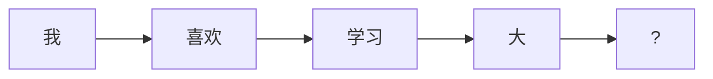

`CLM` 是 **Causal Language Model（因果语言模型）** 的缩写，也称为 **自回归语言模型（Autoregressive Language Model）**。它与 MLM (Masked Language Model) 是两种不同的语言建模方法，在目标、训练方式和应用场景上有本质区别：

---

### 核心对比：CLM vs MLM
| 特性 | CLM (Causal LM) | MLM (Masked LM) |
|------|-----------------|----------------|
| **核心目标** | 预测下一个词 | 预测被遮蔽的词 |
| **上下文使用** | 仅左侧上下文 | 双向上下文 |
| **训练方式** | 自回归生成 | 填空式预测 |
| **典型模型** | GPT系列 | BERT系列 |
| **注意力机制** | 因果掩码（单向） | 全连接（双向） |
| **应用场景** | 文本生成 | 文本理解 |

---

### CLM 详解

#### 1. 工作原理

- **输入**：序列 `["我", "喜欢", "学习", "大"]`
- **目标**：预测下一个词 `E`
- **训练损失**：$P(\text{模型} | \text{我,喜欢,学习,大})$

#### 2. 训练过程
```python
# 输入序列
input_ids = [101, 2769, 1300, ...]  # [CLS] 我 喜欢 学习 大

# 训练标签（右移一位）
labels = [2769, 1300, ..., 0]      # 我 喜欢 学习 大 [MASK]

# 计算损失（仅计算有效位置）
loss = cross_entropy(logits[:, :-1], labels[:, 1:])
```

#### 3. 关键技术
- **因果掩码**：防止看到未来信息
  ```python
  # 上三角矩阵掩码
  mask = [[0, -inf, -inf],
          [0,   0, -inf],
          [0,   0,    0]]
  ```
- **位置偏移**：标签比输入右移一位
- **自回归生成**：逐词生成输出

---

### 实际案例对比

#### 案例：处理句子"我喜欢学习大模型"
| 步骤 | CLM 方式 | MLM 方式 |
|------|----------|----------|
| **输入** | `[CLS] 我 喜欢 学习 大` | `[CLS] 我 [MASK] 学习 大 模型` |
| **目标** | 预测"模型" | 预测"喜欢" |
| **上下文** | 只能看到左侧词 | 看到全部上下文 |
| **模型行为** | 基于"大"预测下一个词 | 基于整句预测[MASK]处词 |
| **输出层** | 线性层输出词表分布 | 仅预测遮蔽位置 |

---

### 为什么需要 CLM？

#### 1. 文本生成需求
- 机器翻译：`英文→` 自回归生成中文
- 故事创作：逐词续写文本
- 代码补全：`import numpy as` → `np`

#### 2. 人类语言特性
- 语言本质是顺序生成过程
- 符合认知："听前半句→预测后半句"

#### 3. 技术优势
```python
# 简易CLM生成代码
def generate_text(prompt):
    while True:
        logits = model(prompt)
        next_token = sample(logits[:, -1])  # 取最后一个预测
        if next_token == EOS: break
        prompt = torch.cat([prompt, next_token])
    return prompt
```

---

### 典型应用场景
| 应用领域 | CLM 模型 | MLM 模型 |
|----------|----------|----------|
| **文本生成** | GPT-3/4 | ❌ 不适用 |
| **文本分类** | ✅ 可用 | ✅ BERT更优 |
| **问答系统** | 生成式答案 | 抽取式答案 |
| **代码生成** | GitHub Copilot | ❌ 不适用 |
| **文本填充** | ❌ 低效 | ✅ BERT专项 |

---

### 在原始代码中的体现
您提供的代码实际实现了 CLM：
```python
# 前向传播函数 (transformer.py)
def forward(self, idx, targets=None):
    # ...
    # 推理阶段：只取最后一个token预测
    logits = self.lm_head(x[:, [-1], :])  # 典型CLM做法
```

而 MLM 需要修改为：
```python
# MLM 修改方案
def forward(self, idx, mask_positions):
    # ...
    # 只计算遮蔽位置的输出
    masked_output = x[mask_positions]
    logits = self.lm_head(masked_output)  # 预测遮蔽词
```

---

### 总结：CLM 的本质
1. **因果性**：预测$t$时刻只能使用$<t$的信息
2. **自回归**：输出作为下一步输入
3. **生成导向**：适合创造新内容
4. **单向模型**：GPT 系列的基础

而 MLM 是：
1. **双向理解**：利用全句信息
2. **填空任务**：预测特定位置
3. **理解导向**：适合分类/标注任务
4. **非自回归**：BERT 系列的基石

两者共同构成了现代语言模型的核心范式，分别服务于生成和理解两大 NLP 任务领域。