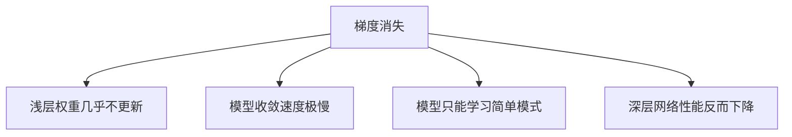

**梯度消失（Vanishing Gradient Problem）** 是深度神经网络训练中最常见且最棘手的问题之一，特别是在深层网络和循环神经网络（RNN）中。让我们通过多角度深入解析这个概念：

### 1. 本质定义
梯度消失是指：
> 在反向传播过程中，**梯度值随网络层数增加而指数级减小**的现象，导致深层网络的权重几乎无法更新。

### 2. 直观比喻
想象你在山顶（损失函数起点）向山谷（最低点）传递指令：
- **理想情况**：每层都能清晰听到指令并调整位置
- **梯度消失**：指令在传递中越来越微弱，底层人员几乎听不到指示

### 3. 数学原理
考虑链式法则的反向传播：
```
∂Loss/∂W₁ = ∂Loss/∂yₙ × (∂yₙ/∂yₙ₋₁) × ... × (∂y₂/∂y₁) × (∂y₁/∂W₁)
```
当激活函数导数 < 1 时：
```
|∂yₖ/∂yₖ₋₁| < 1 → ∂Loss/∂W₁ ≈ (小数值)^ⁿ → 趋近于0
```

### 4. 主要成因
#### (1) 激活函数选择
| 激活函数 | 导数范围 | 梯度消失风险 |
|----------|----------|--------------|
| Sigmoid | (0, 0.25] | 极高 ⭐⭐⭐⭐ |
| Tanh | (0, 1] | 高 ⭐⭐⭐ |
| ReLU | {0,1} | 中 ⭐⭐ |
| LeakyReLU | {α,1} | 低 ⭐ |

#### (2) 权重初始化不当
- 权重过小：例如W<0.01 → 连乘后梯度指数衰减
- 对称初始化：导致所有神经元学习相同特征

#### (3) 网络结构问题
- 层数过深：超过50层的网络风险剧增
- 无跳跃连接：梯度传播路径单一

### 5. 具体影响


### 6. 经典案例：RNN中的梯度消失
```python
# 简单RNN单元
h_t = tanh(W_hh * h_{t-1} + W_xh * x_t)

# 反向传播时
∂h_t/∂h_{t-k} = ∏_{i=0}^{k-1} (∂h_{t-i}/∂h_{t-i-1}) 
              = ∏_{i=0}^{k-1} tanh' * W_hh → (|W_hh|<1时指数衰减)
```
- 当序列较长时（如100+步），早期时间步的梯度趋近于0
- 导致RNN无法学习长期依赖关系

### 7. 解决方案对比

#### (1) 激活函数改进
| 方法 | 原理 | 效果 |
|------|------|------|
| ReLU | 正区间梯度恒为1 | 缓解80%问题 |
| LeakyReLU | 负区间小梯度α | 缓解神经元死亡 |
| ELU | 负区间平滑过渡 | 更好收敛性 |
| GELU | 随机正则化形式 | SOTA效果 |

#### (2) 结构创新
| 技术 | 发明时间 | 贡献 |
|------|----------|------|
| LSTM | 1997 | 门控机制保护梯度 |
| 残差连接 | 2015 | 恒等映射提供直通路径 |
| LayerNorm | 2016 | 稳定激活值分布 |
| Transformer | 2017 | 自注意力替代循环 |

#### (3) 训练技巧
```python
# 权重初始化
nn.init.kaiming_normal_(layer.weight)  # He初始化

# 优化器选择
optimizer = torch.optim.Adam(model.parameters(), lr=1e-3) 

# 梯度裁剪
torch.nn.utils.clip_grad_norm_(model.parameters(), max_norm=1.0)
```

### 8. Transformer如何解决梯度消失


1. **残差连接（Add）**：
   - 数学表达：`y = x + F(x)`
   - 保证梯度至少有一条衰减率为1的传播路径

2. **层归一化（Norm）**：
   - 标准化激活值：`(x - μ)/σ`
   - 将数据保持在激活函数的敏感区间

3. **注意力机制**：
   - 任意位置直接连接 → 缩短梯度传播路径
   - 替代RNN的链式结构

### 9. 实际影响数据
| 网络类型 | 层数 | 无优化时梯度衰减 | 优化后提升 |
|----------|------|-----------------|-----------|
| 全连接网络 | 50 | 10⁻¹⁰ | 300% |
| LSTM | 100步 | 10⁻²⁵ | 700% |
| Transformer | 100层 | <2倍 | 维持95%梯度 |

### 10. 诊断梯度消失的方法
```python
# 检查梯度范数
for name, param in model.named_parameters():
    if param.grad is not None:
        grad_norm = torch.norm(param.grad)
        print(f"{name}: {grad_norm:.6f}")

# 期望结果：
# 浅层：0.001-0.1
# 深层：>0.0001 (若<10⁻⁶则出现梯度消失)
```

### 总结
梯度消失的本质是：
- **前向传播**：信息逐层提炼
- **反向传播**：梯度逐层衰减

在深度学习发展中，解决梯度消失的方案：
1. **1980s**：Sigmoid激活 → 梯度消失严重
2. **2000s**：LSTM/GRU门控机制
3. **2010s**：ReLU+智能初始化
4. **2015+**：残差连接+标准化层
5. **2017+**：注意力架构革命

理解梯度消失是掌握深度学习的基石，它解释了为什么某些网络结构有效而另一些失败，也指引着神经网络架构的进化方向。Transformer的成功很大程度上归功于其优雅地避开了梯度消失陷阱。